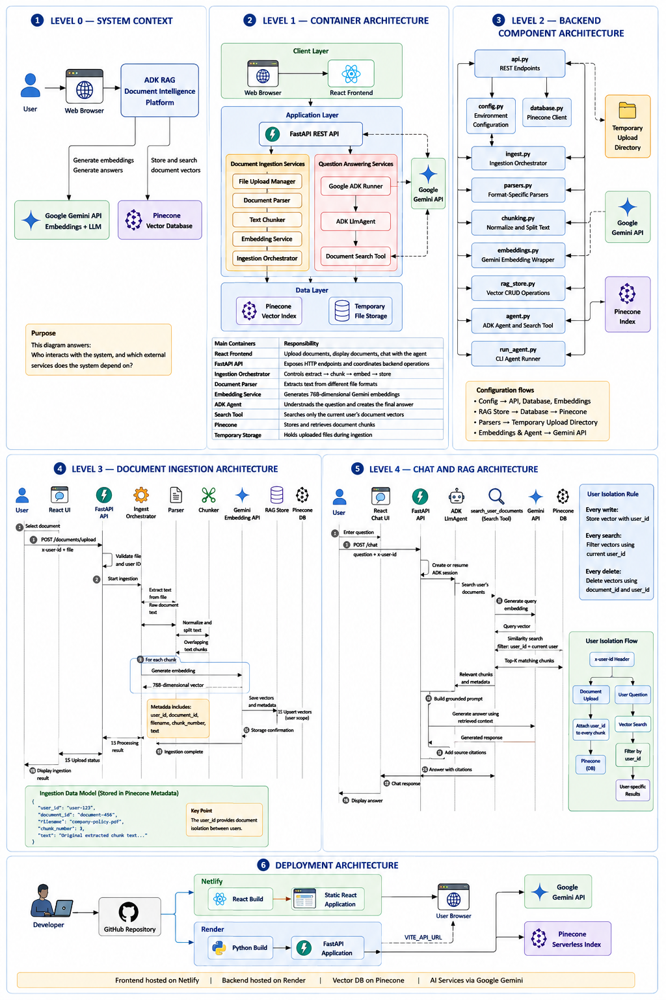

# ADK RAG

> **Document Intelligence Platform** — Upload, ingest, and chat with your documents using Google ADK, Gemini, and Pinecone DB.

[](https://python.org)
[](https://fastapi.tiangolo.com)
[](https://developers.google.com/adk)
[](https://www.pinecone.io)
[](https://react.dev)

---

## Table of Contents

- [Overview](#overview)
- [Features](#features)
- [Architecture](#architecture)
- [Quick Start](#quick-start)
- [Deployment](#deployment)
- [Project Structure](#project-structure)
- [Supported File Types](#supported-file-types)
- [API Endpoints](#api-endpoints)
- [Documentation](#documentation)
- [Production Recommendations](#production-recommendations)

---

## Overview

ADK RAG is a **Retrieval-Augmented Generation** system that lets users upload documents, converts them into searchable vector embeddings, and answers natural language questions using only the user's uploaded content.

Each user has an **isolated document workspace** — one user cannot access another user's documents.

---

## Features

| Feature | Details |
|---------|---------|
| **Document Upload** | PDF, DOCX, XLSX, XLS, PPTX, TXT, MD, CSV, JSON, XML, HTML, LOG |
| **Text Extraction** | Format-specific parsers (PyMuPDF, python-docx, openpyxl, python-pptx) |
| **Chunking** | Overlapping 1200-character chunks, 200-character overlap |
| **Embeddings** | Gemini `gemini-embedding-001`, 768 dimensions |
| **Vector Store** | Pinecone DB Serverless Index |
| **AI Agent** | Google ADK `LlmAgent` powered by `gemini-2.5-pro` |
| **Source Citations** | `[Source: filename, chunk N]` in every answer |
| **React UI** | Dark glassmorphism theme, drag-and-drop upload, chat interface |
| **User Isolation** | All Pinecone DB queries are filtered by `user_id` |

---

## Architecture



### Ingestion pipeline (step by step)

```
File uploaded
    ↓
parsers.py      — extract raw text by file type
    ↓
chunking.py     — normalize whitespace, split into 1200-char overlapping chunks
    ↓
embeddings.py   — Gemini gemini-embedding-001 → 768-dim vectors
    ↓
rag_store.py    — store chunks + embeddings + metadata in Pinecone DB
```

---

## Quick Start

### Prerequisites

- Python 3.10 or later
- Node.js 18 or later (for the React UI)
- A [Google API key](https://aistudio.google.com/app/apikey)
- A [Pinecone API key](https://app.pinecone.io/) and an Index with **768 dimensions** using **cosine similarity**.

### 1 — Clone and enter the project

```bash
git clone <YOUR_REPOSITORY_URL>
cd adk_rag
```

### 2 — Set up the Python environment

```bash
python3 -m venv .venv
source .venv/bin/activate          # Windows: .venv\Scripts\activate
pip install -r requirements.txt
```

### 3 — Configure environment variables

```bash
cp .env.example .env
# Edit .env and add your API keys
```

```env
GOOGLE_API_KEY=your_google_api_key_here
PINECONE_API_KEY=your_pinecone_api_key_here
PINECONE_INDEX_NAME=documents
TOP_K=5
```

### 4 — Start the backend API

```bash
uvicorn app.api:app --reload
# API available at http://localhost:8000
# Swagger UI at http://localhost:8000/docs
```

### 5 — Start the React UI

```bash
cd frontend
npm install
npm run dev
# UI available at http://localhost:5173
```

### 6 — Open the app

Navigate to **http://localhost:5173**, enter your User ID, and start uploading documents.

---

## Deployment

The application is configured to easily deploy the frontend to **Netlify** and the backend to **Render**. Both support free tier options.

### Frontend Deployment (Netlify)
The React frontend is configured for Netlify SPA deployment.
1. Create a new site on Netlify from your Git repository.
2. Ensure the Build command is `npm run build` and the Publish directory is `dist`.
3. Set the `VITE_API_URL` environment variable to your Render backend URL (e.g. `https://adk-rag-backend.onrender.com`).
4. `netlify.toml` is provided to handle standard React Router SPA redirects automatically.

### Backend Deployment (Render)
The FastAPI backend is configured for Render.
1. Connect your repository to Render as a "Web Service".
2. The `render.yaml` Blueprint specifies the environment. (Alternatively, set Build Command to `./build.sh` and Start Command to `uvicorn app.api:app --host 0.0.0.0 --port $PORT`).
3. Set your environment variables in the Render dashboard:
   - `GOOGLE_API_KEY`
   - `PINECONE_API_KEY`
   - `PINECONE_INDEX_NAME`
   - `ALLOWED_ORIGINS` (Set this to your Netlify URL e.g. `https://my-rag-app.netlify.app`)

---

## Project Structure

```
adk_rag/
├── app/
│   ├── __init__.py
│   ├── agent.py          # Google ADK LlmAgent + search tool
│   ├── api.py            # FastAPI endpoints (upload, chat, delete, status)
│   ├── chunking.py       # Text normalization and overlapping chunker
│   ├── config.py         # Environment variable loading
│   ├── database.py       # Pinecone DB client initialization
│   ├── embeddings.py     # Gemini embedding wrapper
│   ├── ingest.py         # Orchestrates extract → chunk → embed → store
│   ├── parsers.py        # Format-specific text extractors
│   ├── rag_store.py      # Pinecone DB CRUD operations
│   └── run_agent.py      # Standalone CLI agent runner
├── frontend/
│   ├── src/
│   │   ├── components/   # React components
│   │   │   ├── UserIdModal.jsx    # User ID gate
│   │   │   ├── Header.jsx         # App header + sub-header
│   │   │   ├── Tabs.jsx           # Tab navigation
│   │   │   ├── UploadTab.jsx      # Drag-and-drop upload
│   │   │   ├── DocumentsTab.jsx   # Document list + delete
│   │   │   ├── IngestionTab.jsx   # Pipeline status + file types
│   │   │   ├── ChatTab.jsx        # RAG chat interface
│   │   │   └── ChatMessage.jsx    # Message bubble component
│   │   ├── api.js         # API utility functions
│   │   ├── App.jsx        # Root component
│   │   └── index.css      # Design system (dark glassmorphism)
│   ├── index.html
│   ├── netlify.toml      # Netlify deployment configuration
│   ├── package.json
│   └── vite.config.js
├── docs/
│   ├── ARCHITECTURE.md   # System architecture deep-dive
│   ├── API.md            # All API endpoints with examples
│   ├── CHAT.md           # ADK agent and chat system
│   ├── FRONTEND.md       # React UI guide
│   ├── INGESTION.md      # Ingestion pipeline walkthrough
│   ├── INSTALLATION.md   # Step-by-step installation
│   └── TROUBLESHOOTING.md # Common errors and fixes
├── uploads/              # Temporary file storage (auto-cleaned)
├── .env                  # Your local environment (do not commit)
├── .env.example          # Environment variable template
├── requirements.txt      # Python dependencies
├── build.sh              # Backend build script for Render
├── render.yaml           # Render deployment Blueprint
└── README.md
```

---

## Supported File Types

| Extension | Parser | Notes |
|-----------|--------|-------|
| `.pdf` | PyMuPDF | Text-based PDFs only. Scanned PDFs require OCR. |
| `.docx` | python-docx | Full paragraph extraction. |
| `.xlsx` | openpyxl | All sheets extracted row by row. |
| `.xls` | openpyxl | Legacy Excel format. |
| `.pptx` | python-pptx | Slide-by-slide text extraction. |
| `.txt` | Plain reader | UTF-8 with error-ignore fallback. |
| `.md` | Plain reader | Markdown treated as plain text. |
| `.csv` | Plain reader | Raw CSV values. |
| `.json` | Plain reader | Raw JSON text. |
| `.xml` | Plain reader | Raw XML markup. |
| `.html` / `.htm` | Plain reader | HTML tags included. |
| `.log` | Plain reader | Log files as plain text. |

---

## API Endpoints

| Method | Path | Description |
|--------|------|-------------|
| `GET` | `/health` | Health check |
| `GET` | `/ingest/status` | Pipeline status + chunk count |
| `POST` | `/documents/upload` | Upload and ingest a document |
| `GET` | `/documents` | List user's documents |
| `DELETE` | `/documents/{id}` | Delete a document and its chunks |
| `POST` | `/chat` | Chat with the ADK agent |

All document endpoints require the `x-user-id` header.

See [docs/API.md](docs/API.md) for full examples.

---

## Documentation

| Document | Description |
|----------|-------------|
| [INSTALLATION.md](docs/INSTALLATION.md) | Step-by-step environment setup |
| [ARCHITECTURE.md](docs/ARCHITECTURE.md) | System design and data flow |
| [INGESTION.md](docs/INGESTION.md) | Ingestion pipeline walkthrough |
| [API.md](docs/API.md) | All API endpoints with curl examples |
| [CHAT.md](docs/CHAT.md) | ADK agent and session lifecycle |
| [FRONTEND.md](docs/FRONTEND.md) | React UI setup and component guide |
| [TROUBLESHOOTING.md](docs/TROUBLESHOOTING.md) | Common errors and fixes |

---

## Production Recommendations

For production deployments, consider:

- **Authentication**: Replace `x-user-id` header with Firebase Auth, Google Identity Platform, or JWT
- **Vector storage**: PostgreSQL with pgvector, Vertex AI Vector Search, or AlloyDB (or Pinecone Serverless).
- **Document storage**: Google Cloud Storage for original files
- **Async ingestion**: Cloud Pub/Sub + worker service for large file processing
- **OCR**: Tesseract, Google Document AI, or Cloud Vision API for scanned PDFs
- **Rate limiting**: API Gateway or FastAPI middleware
- **Security**: File size limits, virus scanning, content validation

---

## Author

Created by **Drona**.

## License

MIT License